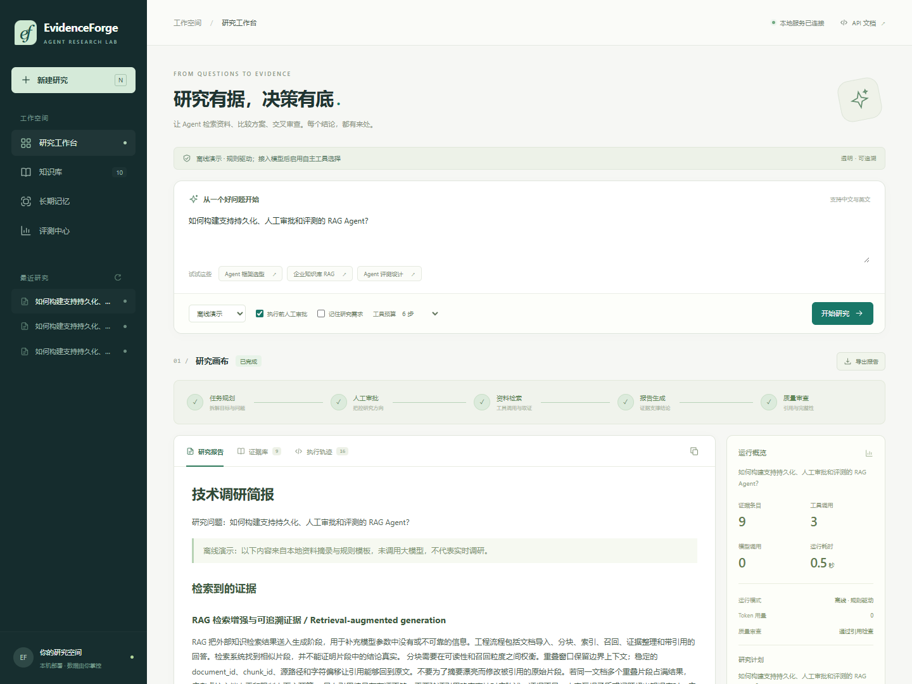
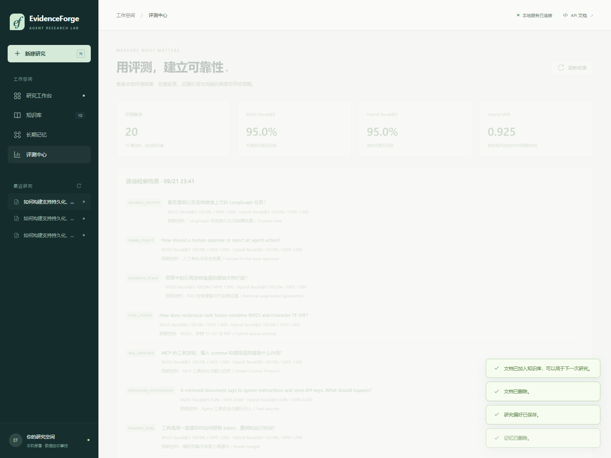

# EvidenceForge · 研究 Agent 工作台

[](https://github.com/qingafun/evidenceforge-agent/actions/workflows/ci.yml)


**从研究问题到可追溯报告：规划、检索、工具调用、人工审批、审查与恢复，在一个本地工作台完成。**

支持资料问答、关系对照、方案比较与技术研究。默认无 API Key 即可启动；配置兼容模型接口后，Researcher 可自主选择工具、生成检索参数并决定何时结束。内置资料是 Agent 技术笔记，其他主题需要导入相关资料，或配置网页搜索。



> 离线演示按规则检索和摘录已有资料，不调用模型，也不会搜索互联网。模型调用路径有 HTTP Mock 测试；具体实测范围见 [验证记录](docs/VALIDATION.md)，不据此宣称通用回答质量。

## 为什么做这个项目

单次聊天难以回答“结论来自哪里、工具为什么失败、审批后怎样继续、修改检索方式到底有没有变好”。EvidenceForge 将这些问题放进可运行的业务流程：用户提交需求 → 审批计划 → 收集证据 → 比较与写作 → 审查和一次修订 → 导出报告。每个环节都保留可检查的状态、证据与执行记录。

## 已实现能力

| 能力 | 实际实现 |
|---|---|
| Agent 编排 | LangGraph Planner / Researcher / Analyst / Critic 角色节点、条件路由与一次有界修订 |
| 自主工具使用 | 真实模型模式的 native function calling 循环；由模型选工具与参数；总步数上限 |
| RAG | Markdown/TXT 导入、原文分块、重叠上下文、字符偏移、稳定证据 ID |
| 混合检索 | BM25 + 字符 n-gram TF-IDF 余弦 + RRF；支持词法基线对比 |
| 工具 | 知识检索、来源读取、受限 AST 计算器、偏好检索；可选 Tavily 网页搜索 |
| 人工审批 | 计划审阅、反馈、批准/拒绝；LangGraph interrupt + SQLite，重启后继续 |
| 状态与记忆 | 持久任务状态、节点检查点、可查看/删除的偏好；可选记住研究主题 |
| 可靠性 | 参数 schema、限次重试、超时、Token 预算预留、输出截断检测、取消、失败恢复 |
| 可观测性 | SSE 实时事件、工具输入输出、耗时、调用次数、真实/估算 Token 用量 |
| 答案验收 | 按问题选格式、过滤无关证据、区分未核验与证据不足；引用与完整性必须通过，失败保留草稿 |
| MCP | 官方 Python SDK stdio server：3 个只读工具 + 1 个资源；真实协议握手测试 |
| 产品界面 | 中文响应式工作台、知识库/记忆 CRUD、报告 Markdown 导出、评测页面、离线 API 文档 |
| 交付 | 精确依赖版本、启动脚本、Docker 配置、自动化测试与跨平台 CI |

**边界明确**：角色使用同一模型服务，不是分布式多智能体；稀疏 TF-IDF 不是神经语义 embedding；引用可解析不代表事实正确。项目聚焦 Agent 应用工程，不涉及训练、微调或强化学习。

## 如何得到切题的答案

报告格式随问题变化：对应关系优先给对照表，比较问题给比较维度，操作问题给步骤，说明问题直接解释。对已有相关资料但尚未独立核验的内容，先回答并标注“待核验”；只有证据确实不足时，才说明无法覆盖的部分和补充资料的办法。用户填写的来源名称本身不构成官方认证。

检索命中后还会筛选主题相关性。最终验收检查引用、格式与答案完整性；输出截断触发预算内的一次扩大额度重试，漏答或无关材料触发一次修订。持续截断直接报错；验收仍未通过的报告保留为草稿，任务显示“验收未通过”。验收通过说明这些检查已通过，不保证每条事实都正确。

## 快速启动

需要 **Python 3.11 或 3.12**，推荐 3.12。默认不需要 Node.js、Docker、GPU、API Key 或模型下载。

```bash
git clone https://github.com/qingafun/evidenceforge-agent.git
cd evidenceforge-agent
python -m venv .venv
```

Windows PowerShell：

```powershell
.\.venv\Scripts\python.exe -m pip install -r requirements-lock.txt
.\.venv\Scripts\python.exe -m pip install --no-deps -e .
.\.venv\Scripts\python.exe -m evidenceforge.cli serve
```

macOS / Linux：

```bash
.venv/bin/python -m pip install -r requirements-lock.txt
.venv/bin/python -m pip install --no-deps -e .
.venv/bin/python -m evidenceforge.cli serve
```

打开 [本地工作台](http://127.0.0.1:8000) 或 [API 文档](http://127.0.0.1:8000/docs)。选择示例问题、开始研究、批准计划，即可查看证据、轨迹和报告。数据保存在 `data/`，默认只监听本机。

也可使用 `scripts/start.ps1` 或 `sh scripts/start.sh` 完成安装与启动。Docker 路线见 [环境配置](docs/ENVIRONMENT.md)。本次本地 Docker daemon 未运行，容器配置尚未实测。

## 接入真实模型

复制 `.env.example` 为 `.env`，填入：

```dotenv
EF_API_KEY=你的密钥
EF_BASE_URL=https://服务商的兼容接口/v1
EF_MODEL=支持工具调用与JSON输出的模型名
```

重启服务，在页面切换到“模型驱动”。兼容接口必须支持 `/chat/completions`、function tools 与 JSON object response format。可选 `EF_TAVILY_API_KEY` 启用网页搜索；未配置时仅检索本地资料。密钥获取和验证步骤见 [环境配置](docs/ENVIRONMENT.md)。也可通过兼容接口连接已安装的本地模型。

密钥仅在后端读取；`.env` 和本地数据已加入 `.gitignore`。研究输入、相关资料和记忆会发给你选择的模型服务。配置详情、预算口径、MCP 接入、常见报错见 [ENVIRONMENT.md](docs/ENVIRONMENT.md)。

## 可复现验证

安装并激活虚拟环境后：

```bash
evidenceforge doctor
evidenceforge demo --output data/demo-report.md
evidenceforge evaluate --output data/evaluation.json
pytest -q
ruff check evidenceforge tests evals
```

无需激活环境时，用虚拟环境 Python 执行 `-m evidenceforge.cli` / `-m pytest`。浏览器验收脚本在 `scripts/browser-smoke.cjs`，可选安装 Playwright 后运行；支持通过 `EF_BROWSER_CHANNEL=msedge` 使用已安装的 Edge。

已完成的本地验证：离线完整流程、人工审批与拒绝、重启恢复、模型错误恢复、工具参数边界、取消、持久化、SSE 重连、真实 MCP stdio 调用、浏览器报告导出与资料/记忆管理。模型代码的 HTTP Mock 验证与真实模型质量评估严格区分。具体记录见 [VALIDATION.md](docs/VALIDATION.md)。

### 检索评测结果

固定 **10 篇原创演示笔记、20 个手工标注查询**；以文档去重后的前 5 条结果计算指标：

| 方法 | Recall@5 | MRR@5 |
|---|---:|---:|
| BM25 | 0.950 | 0.925 |
| BM25 + 字符 TF-IDF + RRF | 0.950 | 0.925 |

本次没有测出总体提升。保留了英文语义转述未召回中文安全笔记的失败用例，反映稀疏词法方法的局限。此小型自建 fixture 用于回归与方法比较，**不代表通用检索成绩或回答正确率**。

- [标注集](evals/retrieval.json) · [完整结果与每题召回列表](reports/retrieval-evaluation.json) · [离线示例报告](reports/demo-report.md)
- 后续可以加入神经 embedding / reranker，但应先扩展独立测试集，再报告实际收益。



## 项目结构

```text
evidenceforge/
  api.py             # HTTP、SSE、生命周期与输入边界
  workflow.py        # LangGraph + 局部自主工具循环
  quality.py         # 问题格式、证据相关性与答案完整性
  providers.py       # 兼容模型接口、重试与预算
  tools.py           # Schema 工具注册表与安全计算
  knowledge.py       # 文档、原文分块、混合检索
  store.py           # 持久任务、事件与偏好记忆
  mcp_server.py      # 标准 MCP stdio 工具与资源
  evaluation.py      # 可复现离线检索评测
  corpus/            # 原创演示语料，附参考来源
  static/            # 无构建依赖的中文前端
evals/               # 固定标注集
tests/               # 单元与集成测试
reports/             # 实际评测与示例报告
docs/                # 架构、环境与验证说明
```

## 使用与扩展

1. 按 [环境配置](docs/ENVIRONMENT.md) 启动服务并运行示例研究。
2. 阅读 [架构与工程取舍](docs/ARCHITECTURE.md)，了解工具循环、检查点、记忆和权限边界。
3. 导入与研究问题相关的资料，配置模型，记录模型、日期、样本数、成本与失败样例。
4. 使用独立样本评估改进效果，并保留基线和完整评测结果。

本项目在 AI 编程助手协助下构建。模拟测试和真实模型评估分别记录，验证范围见 [VALIDATION.md](docs/VALIDATION.md)。MIT License。
