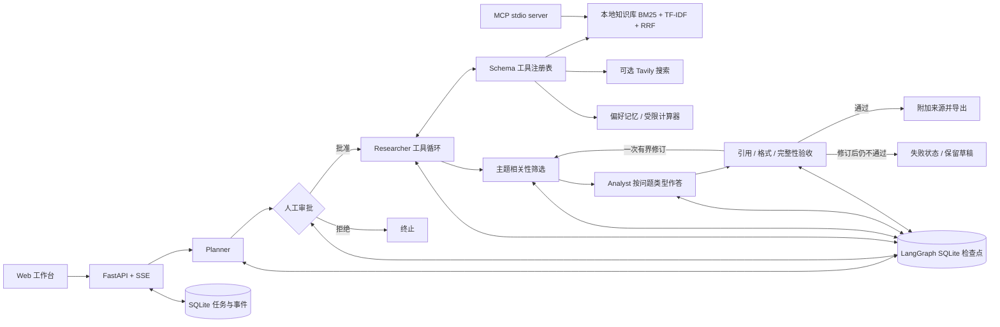

# 架构与工程取舍

EvidenceForge 是一个单用户本地研究工作台。确定性工作流负责生命周期；真实模型在 research 节点内自主选工具、生成参数并决定何时停止。Planner、Researcher、Analyst、Critic 是同一模型服务上的角色分工，不是四个独立训练模型，也没有实现分布式多 Agent 通信。

## 模块边界

| 模块 | 责任与关键点 |
|---|---|
| `api.py` | 严格请求 schema、后台执行、任务状态转换、可重连 SSE、同源写入限制 |
| `workflow.py` | 任务格式、结构化计划、人工 interrupt、工具循环、证据筛选、完整性验收、修订上限 |
| `quality.py` | 问题类型与输出要求、主题词筛选、表格逐项覆盖、结构与明显截断检查 |
| `providers.py` | 兼容 chat completions、截断检测、超时与重试、预算预留、真实/估算用量区分、脱敏错误 |
| `tools.py` | 工具白名单、Pydantic 参数验证、安全算术 AST、可选固定服务网页检索 |
| `knowledge.py` | 原文分块与重叠、内容标识、Unicode 字符偏移、稀疏混合检索 |
| `store.py` | 任务/事件/显式偏好记忆；取消状态不可被迟到的 worker 覆盖 |
| `mcp_server.py` | SDK 提供的 stdio tools/resources 接口，不自行伪造协议 |
| `evaluation.py` | 标注检索 fixture、文档级 Recall@5 / MRR、可复现基线 |

## 关键实现

**RAG**：导入 Markdown/纯文本 → 保留原文分块 → BM25 与字符 n-gram TF-IDF → RRF 融合 → 主题相关性筛选 → 有来源 ID 的上下文 → 报告引用。检索分数只是候选排序，不能独自证明内容与研究问题相关。TF-IDF 是稀疏词法向量，不等于神经网络语义 embedding。本实现每次查询在小语料上计算排序，适合演示/个人资料，不宣称百万文档规模。

**回答与验收**：计划保留用户真正要求回答的问题，并选择相应格式；不会把一般资料问答统一改成技术选型。答案依据区分 `unverified`（有相关资料，但尚未独立核验）与 `insufficient_evidence`（证据不足）。当前流程不自动认证来源；未核验内容仍可在明确归属和引用下作答，手工来源标签不会自动变成官方认证。验收同时检查引用、主题相关性、格式与完整性，模型的一次 `passed: true` 不能覆盖其他检查失败。一次修订后仍失败，任务状态为 `failed`，报告保留为带提示的草稿；只有通过验收才能标记 `completed`。离线模式只检查摘录结构与可见条目覆盖；在线模式另外要求模型进行语义审查，两者都不能保证事实正确。

**输出截断**：适配器检查模型的结束原因。因长度限制截断的响应不能作为完整答案返回，会在任务总预算允许时提高输出上限并重试一次。写作使用比普通规划调用更大的输出额度，仍受任务累计预算约束。输出结构与回答覆盖情况还需在报告验收阶段检查，不能仅凭调用成功或引用合法判定完成。

**两种记忆**：LangGraph 检查点是任务内状态；`memories` 表保存用户输入的偏好和选择保存的研究主题。偏好在规划/写作阶段读取，可以删除。研究历史摘要只记录主题与审查状态，不自动把模型结论升级为事实。

**人工介入**：计划提交后，`interrupt()` 先持久化状态。HTTP 审批使用条件状态更新，只有一个请求可以领取审批。`Command(resume=...)` 使用同一任务 ID 继续。拒绝终止；补充约束传给真实 Researcher 与 Analyst。离线模板不会理解反馈，仅保存审批记录。

**故障恢复**：启动时把未完成的 queued/running 任务标记为失败，页面可手动恢复。恢复使用已持久化的节点边界。整个 research 节点失败时，其工具循环会从该节点起点重做；当前预算统计保留，已发生请求可能重复计费。工具均只读，因此重放没有外部写入副作用。并不提供 exactly-once 执行保证。

**安全边界**：默认只绑定 loopback、限制 Host 与跨来源写入；工具无 shell、任意文件路径或任意 URL 抓取；模型和证据不能直接修改权限；计算器仅解释有限 AST 节点。提示注入无法仅靠提示词彻底解决，本实现通过受限工具降低影响，未提供完整对抗鲁棒性保证。

**可观测性**：事件记录节点、工具输入输出、耗时、错误与用量；不采集私有思维链。Token 上限是用量边界而非美元硬限额。响应缺少 usage 或请求失败时使用保守估算，并显示 estimated_usage。取消等待正在进行的 HTTP 请求返回，随后阻止后续节点。

## 当前限制与下一步

- 单进程 FastAPI BackgroundTasks + SQLite；多用户部署需要鉴权、持久任务队列、PostgreSQL 和资源隔离。
- 没有任意网页抓取、PDF OCR、代码执行沙箱、神经 embedding/reranker；可作为有评测支持的后续迭代。
- 没有模型训练/微调、强化学习、分布式 Agent 协议；本项目聚焦 Agent 应用工程。
- 引用 ID 完整率只能检查可解析性；模型审查也不是事实正确性的保证。
- 本地数据默认保存在 `data/`，不要将该目录、API Key 或私人导入资料提交到公开仓库。

## 原始资料

- [Anthropic: Building effective agents](https://www.anthropic.com/engineering/building-effective-agents)：工作流与自主 Agent 的区别及常用组合模式。
- [LangGraph persistence](https://docs.langchain.com/oss/python/langgraph/persistence)：检查点与跨任务记忆的不同职责。
- [LangGraph interrupts](https://docs.langchain.com/oss/python/langgraph/interrupts)：审批中断、恢复与节点重放约束。
- [MCP Python SDK](https://github.com/modelcontextprotocol/python-sdk)：工具、资源、stdio 服务和客户端。
- [Ragas context recall](https://docs.ragas.io/en/stable/concepts/metrics/available_metrics/context_recall/)：参考材料与检索召回的评估概念。

代码为本项目实现；知识笔记是原创演示摘要，链接仅用于核对技术概念，不能理解为运行时已抓取最新页面。
